# Hi there🥳

 

<table width="100%">
 <tbody style="text-align:center">
 <tr width="100%">
  <td>
   


  </td>
  
  
  <td>
   
[](https://oliota.com/cv)

  </td>
  
  
  <td>
   
[](https://oliota.com/cursos)&nbsp;

  </td>
 </tr>
 
</tbody>
</table>


---
<!--

<table>
<tbody style="text-align:center">
<tr>
<td>
 
 
 
</td>
<td>
 
  
 
</td>
<td>

 

</td>
</tr>

</tbody>
</table>

-->
 
[](https://git.io/typing-svg)

---


 <!--


-->

<!-- summary:start -->

<!-- updated: 2025-08-21 -->
<!-- summary:end -->


---


<center>
 


 


   
<table width="100%"> 
        <th>

[](https://www.oliota.com)
</th>
        <th>

[](https://www.instagram.com/oliotaartesanato/)
</th>
        <th>

[](https://www.instagram.com/robooliota/)
</th>
        <th>
        
[](https://www.linkedin.com/in/rubem-oliota-abb273120/)
</th> 
        <tr>
            <td>
            <a href="https://www.oliota.com"></a></td>
            <td>
            <a href="https://www.instagram.com/oliotaartesanato/"></a></td>
            <td>
            <a href="https://www.instagram.com/robooliota/">
</a></td>
            <td>
            <a href="https://www.linkedin.com/in/rubem-oliota-abb273120/">
</a></td>
        </tr> 
</table>

[](https://mail.google.com/mail/u/0/?fs=1&to=rubemoliota@gmail.com&su=Contato+-+via+perfil+github&body=Ol%C3%A1+Rubem+Tudo+bem?&tf=cm)&nbsp;
&nbsp;
[](https://www.buymeacoffee.com/oliota/)&nbsp;


</center>
 
<!--
``` javascript
//Fun fact: I once answered the world’s oldest question with a single line of JavaScript
// Which came first, the chicken or the egg?
//Copy , paste and run in browser console
alert("First came the fried eggs, then came the chicken."+[ "🐣","🥚", "🐔", "🐥","🍳"].sort().slice(0,2));

//spoiler First came the fried eggs, then came the chicken.🍳,🐔

```
 -->
 
---

 ## 🎓 Knowledge

<table>
  <tr>
    <td valign="top">
      <h3>👨🏻‍💻 Backend</h3>
      <p>
        
        
        
        
        
        
        
        
        
        
        
      </p>
    </td>
    <td valign="top">
      <h3>👁‍🗨 Frontend</h3>
      <p>
        
        
        
        
        
        
        
        
        
        
        
        
        
        
      </p>
    </td>
  </tr>

  <tr>
    <td valign="top">
      <h3>📲⌚ Mobile / Smartwatch</h3>
      <p>
        
        
        
        
      </p>
    </td>
    <td valign="top">
      <h3>🪑🎲 Database</h3>
      <p>
        
        
        
        
        
        
        
      </p>
    </td>
  </tr>

  <tr>
    <td valign="top">
      <h3>🔧 IDEs</h3>
      <p>
        
        
        
        
        
        
        
        
        
        
      </p>
    </td>
    <td valign="top">
      <h3>💾 Version Control & Deploy</h3>
      <p>
        
        
        
        
        
        
        
        
        <a href="https://play.google.com/store/apps/dev?id=4624325070796601602">
          
        </a>
      </p>
    </td>
  </tr>

 <tr>
  <td colspan="2" valign="top">
    <h3>👨🏻‍🏫🎓 Teacher</h3>
    <p>
      <a href="https://www.superprof.pt/aprenda-java-javascript-node-angular-html-css-git-varios-niveis-basico-avancado-desvende-segredos.html"></a>
      &nbsp;
      <a href="https://www.superprof.pt/ir/30133358-424cd8"></a>
    </p>
  </td>
</tr>

</table>

---

  ##  🏆 Trophies GitHub
  
[](https://github.com/oliota)


 
<!--
  


 


 -->
 


<!-- thought:start -->
<p></p>

<table cellspacing="0" cellpadding="12" border="1" style="border-collapse:separate; border-spacing:0; border:1px solid #ccc; width:100%;">
  <tr>
    <td style="background:#f9f9f9; text-align:center;">
      &quot;Get busy living, or get busy dying.&quot;<br><strong>— Stephen King</strong>
    </td>
  </tr>
</table>

<br><br>
<!-- thought:end -->


 
 

 


